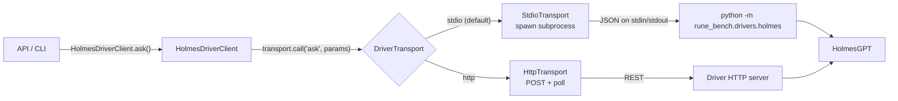

# Architecture: RUNE

## Overview

RUNE is organized in layers:

- CLI layer: rune/__init__.py
  - Typer commands
  - Rich rendering
  - interactive confirmation prompt
- Workflow layer: rune_bench/workflows.py
  - reusable orchestration logic
  - URL normalization and mode selection
  - Vast.ai provisioning workflow
  - Ollama model discovery/warmup orchestration
- Provider/Domain layer:
  - rune_bench/backends/ollama.py — OllamaClient and OllamaModelManager
  - rune_bench/vastai/offer.py
  - rune_bench/vastai/template.py
  - rune_bench/vastai/instance.py
  - rune_bench/common/models.py
  - rune_bench/agents/sre/holmes.py — backward-compatible alias
- Driver layer: rune_bench/drivers/
  - DriverTransport Protocol
  - StdioTransport and HttpTransport
  - holmes driver (rune_bench/drivers/holmes/)

This follows a thin-entrypoint pattern used by popular Python CLIs: commands are lightweight and orchestration is importable/testable.

## Driver Layer

HolmesGPT is decoupled from the core `rune_bench` package via a pluggable driver
transport layer.  The core package does **not** import `holmesgpt` — the agent
runs in a separate process and communicates over a well-defined wire protocol.

### DriverTransport Protocol

```python
class DriverTransport(Protocol):
    def call(self, action: str, params: dict) -> dict: ...
```

Any object with a matching `call` signature is a valid transport.  Two concrete
implementations ship out of the box:

| Transport | How it works |
|-----------|-------------|
| `StdioTransport` | Spawns a subprocess; sends one JSON line on stdin, reads one JSON line from stdout. |
| `HttpTransport` | POSTs to `/v1/actions/{action}`, polls `/v1/jobs/{job_id}` until terminal status. |

### Flow



### Factory function

`make_driver_transport(driver_name)` reads environment variables at call time:

```python
from rune_bench.drivers import make_driver_transport

transport = make_driver_transport("holmes")
result = transport.call("ask", {"question": "...", "model": "llama3.1:8b", ...})
```

See the [Drivers reference](drivers.md) for full env var and wire protocol details.

### Module structure

```text
rune_bench/drivers/
├── __init__.py        # make_driver_transport() factory
├── base.py            # DriverTransport Protocol (runtime-checkable)
├── stdio.py           # StdioTransport
├── http.py            # HttpTransport
└── holmes/
    ├── __init__.py    # HolmesDriverClient (replaces old HolmesRunner internals)
    └── __main__.py    # driver entry point: python -m rune_bench.drivers.holmes
```

`rune_bench/agents/sre/holmes.py` is a backward-compatible alias:
`HolmesRunner = HolmesDriverClient`.

## Commands

### `run-ollama-instance`

- default mode: existing Ollama server (`--ollama-url` required)
- Vast.ai mode: enabled by `--vastai`
- Vast.ai options are explicitly namespaced:
  - `--vastai-template`
  - `--vastai-min-dph`
  - `--vastai-max-dph`
  - `--vastai-reliability`

### `run-agentic-agent`

- runs HolmesGPT directly
- key options:
  - `--question`, `-q`
  - `--model`, `-m`
  - `--kubeconfig`

### `run-benchmark`

- phase 1: choose Ollama source
  - existing server mode (`--ollama-url` + optional `--model`)
  - or Vast.ai mode (`--vastai` + `--vastai-*` options)
- phase 2: run HolmesGPT with selected model

## Workflow Module Contracts

### URL handling

- `normalize_ollama_url(ollama_url)`
- `use_existing_ollama_server(ollama_url, model_name)`

### Vast.ai orchestration

- `provision_vastai_ollama(...)`
  - select offer
  - select model + disk size
  - load template
  - request confirmation callback
  - create instance
  - poll running state
  - pull model
  - return structured result

### Ollama orchestration

- `list_existing_ollama_models(ollama_url)`
- `list_running_ollama_models(ollama_url)`
- `warmup_existing_ollama_model(ollama_url, model_name, ...)`

These operations are implemented by:

- `OllamaClient` (HTTP transport + JSON/error handling)
- `OllamaModelManager` (model lifecycle, unload conflicting models, warmup polling)

This keeps HTTP/API concerns in `rune_bench/backends/ollama` and business flow in `workflows.py`.

### Workflow result dataclasses

- `ExistingOllamaServer`
- `VastAIProvisioningResult`
- `UserAbortedError`

## High-Level Flow

```text
run-ollama-instance
  ├─ if --vastai:
  │    workflow.provision_vastai_ollama(...)
  │    -> print summary + connection table
  └─ else:
       workflow.use_existing_ollama_server(...)
       -> print existing server table

run-agentic-agent
  └─ HolmesRunner.ask(question, model)

run-benchmark
  ├─ phase 1: same selection logic as run-ollama-instance
  └─ phase 2: HolmesRunner.ask(question, selected_model)
```

## Why this refactor

- removes duplicated provisioning logic between commands
- keeps CLI focused on UX, not business orchestration
- enables easier unit testing of workflows
- keeps future providers/agents extensible without bloating `rune/__init__.py`
