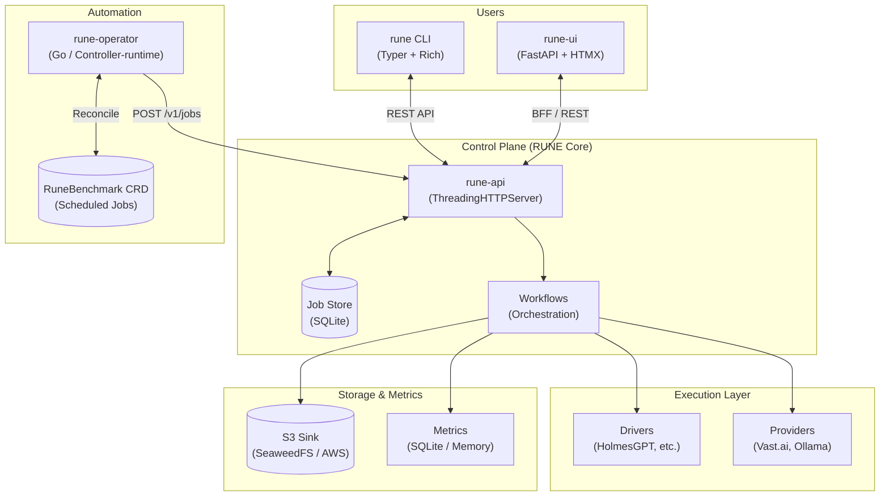
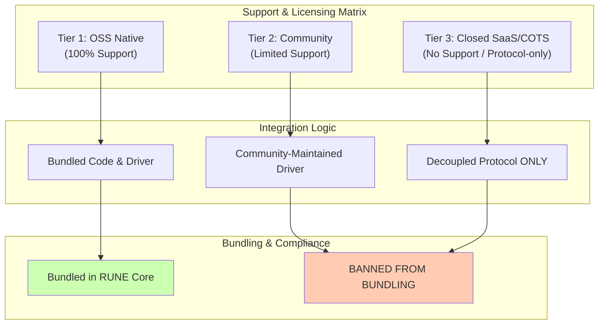
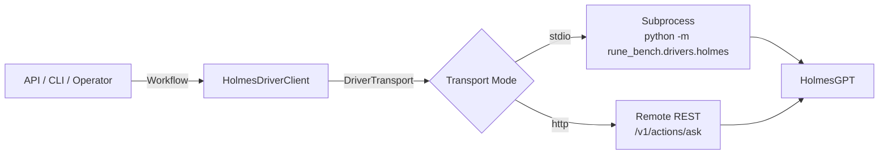
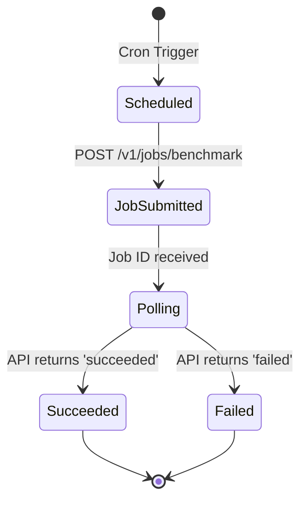
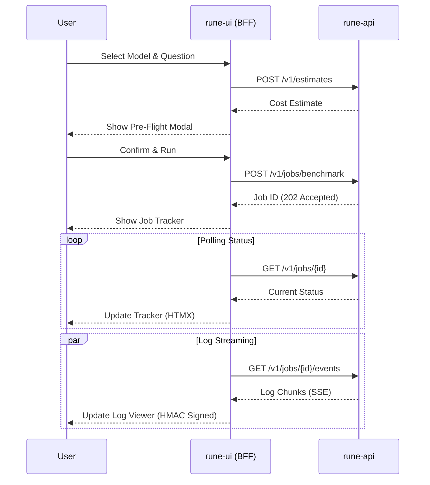

 
# SYSTEM_DESIGN

Mermaid.js diagrams and system boundaries for RUNE.

 
## High-Level Architecture

RUNE is a multi-layered platform for AI benchmarking and provisioning.

 
## Repository Layout

- **`rune/`**: The core engine.
  - `rune/`: CLI and API entrypoints.
  - `rune_bench/`: Core business logic (Workflows, Drivers, Backends, Resources).
- **`rune-operator/`**: Kubernetes operator for declarative scheduling.
- **`rune-ui/`**: Solarized web interface (Zero-NPM, HTMX-based).
- **`rune-charts/`**: Helm charts for all components.
- **`rune-docs/`**: Centralized documentation hub (SSOT).

 
## Agent Support & Licensing Matrix

RUNE maintains a "Clean Room" policy for all agent integrations.

### Supported Agents & Scopes

| Domain | Tier 1: OSS Native (Bundled) | Tier 2: Community | Tier 3: Closed/COTS (No Bundle) |
| :--- | :--- | :--- | :--- |
| **SRE** | K8sGPT, HolmesGPT, Metoro | — | PagerDuty AI, Cleric |
| **Research** | LangGraph | — | Perplexity, Glean, Elicit, Consensus |
| **Art/Creative** | ComfyUI | Krea AI | Midjourney |
| **Cybersec** | PentestGPT, BurpGPT | — | Radiant Security, Mindgard, XBOW |
| **Legal/Ops** | Dagger, CrewAI | — | Harvey AI, Spellbook, MultiOn |
| **DevTools/Code** | OpenHands, Plandex, Sweep | — | Claude Code, Cursor, GitHub Copilot |
| **Productivity** | OpenClaw, AutoGPT | Dify | OpenAI Operator, Sierra, Decagon |

### Emerging Integration Standards

RUNE prioritizes standardized, decoupled protocols for Tier 2 and Tier 3 agents:
- **MCP (Model Context Protocol)**: Universal standard for connecting agents to data/tools.
- **A2A (Agent-to-Agent)**: Protocols for autonomous negotiation between independent agent systems.

 
## Driver Layer Design

HolmesGPT and other agents are decoupled via the `DriverTransport` protocol.

 
## Job Lifecycle (RuneBenchmark Operator)

The operator manages the lifecycle of scheduled benchmarks.

 
## RUNE UI Interaction (HTMX/SSE)

The UI acts as a thin BFF for the RUNE API.

