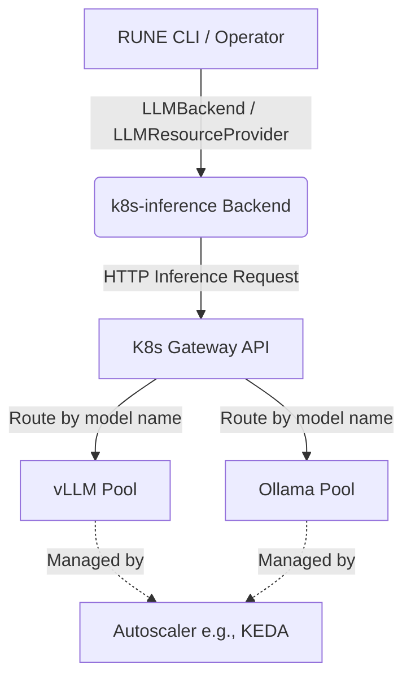

# ADR 0007: Gateway API Inference Extension (`k8s-inference` backend)

## Status

Accepted

## Context

RUNE requires integration with the Kubernetes Gateway API Inference Extension to support cloud-native, scalable model deployments. The goal is to allow RUNE to dynamically route LLM requests to in-cluster model pools (e.g., vLLM or Ollama) without managing direct pod-to-pod dependencies, hardcoded model URLs, or manual infrastructure provisioning. The Gateway API handles routing to specific model pools based on the requested model name, enabling a decoupled architecture.

## Decision

We will implement a `k8s-inference` backend in RUNE that acts as a pass-through router to the Kubernetes Gateway.

### `LLMBackend` Implementation
- **`K8sInferenceBackend`** implements the `LLMBackend` protocol (`rune_bench/backends/k8s_inference.py`).
- The `base_url` points directly to the Kubernetes Gateway endpoint.
- Model capability and availability (`list_models`, `list_running_models`) rely on the Gateway's dynamic routing, delegating these concerns downstream.
- The `warmup` method is treated as a pass-through or no-op from RUNE's perspective, as model warming and scaling are delegated to the cluster's native autoscalers (e.g., KEDA).

### `LLMResourceProvider` Implementation
- A corresponding `K8sInferenceProvider` will implement the `LLMResourceProvider` protocol (`rune_bench/resources/`).
- Because the Gateway API abstracts infrastructure provisioning, the `provision` method will simply return a `ProvisioningResult` pointing to the Gateway's `base_url` and specifying `backend_type="k8s-inference"`.
- The `teardown` method will be a no-op, as lifecycle management is handled natively by the cluster's autoscaler rather than RUNE.

### Architecture Diagram

## Consequences

- **Decoupling**: RUNE is completely decoupled from the specific deployment details and infrastructure of in-cluster models.
- **Simplified Lifecycle**: RUNE does not need to explicitly provision or tear down Kubernetes resources when using this backend.
- **Scalability**: Relies seamlessly on Kubernetes-native autoscaling mechanisms (like KEDA) for model pool scaling based on request metrics at the Gateway level.
- **Gateway Dependency**: Requires the target Kubernetes cluster to have the Gateway API Inference Extension configured properly.
