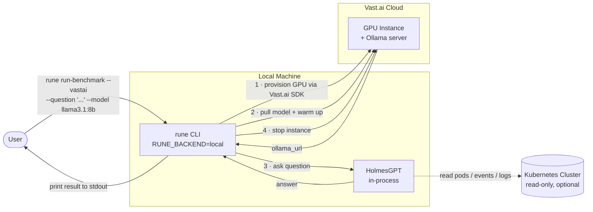
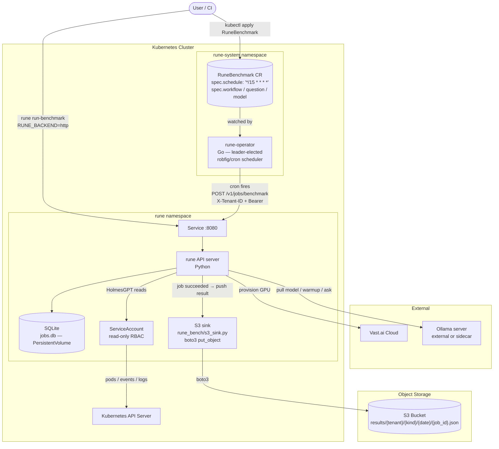
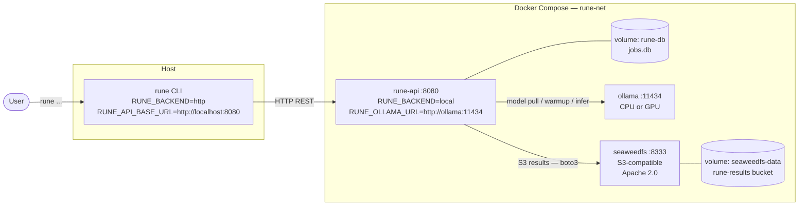

# Deployment Modes

RUNE supports three deployment modes, from a single binary on a laptop to a fully
Kubernetes-native scheduled pipeline. All three share the same core logic — the
difference is where jobs run and where results land.

---

## Mode 1 — CLI only (`RUNE_BACKEND=local`)

The simplest path. The CLI runs every workflow in-process: it talks directly to
Vast.ai to provision a GPU, pulls the model onto the resulting Ollama server, and
then runs HolmesGPT against your Kubernetes cluster. No server, no database, no
extra infrastructure.



### Quick start

```bash
pip install rune

export VAST_API_KEY=...
export RUNE_VASTAI_TEMPLATE=<hash>

rune run-benchmark \
  --vastai \
  --question "Why is the cluster degraded?" \
  --model llama3.1:8b \
  --kubeconfig ~/.kube/config \
  --vastai-stop-instance
```

---

## Mode 2 — CLI + API in Kubernetes

The API server runs as a Kubernetes Deployment (via the `rune` Helm chart).
The CLI switches to HTTP mode and submits jobs to the remote API instead of
executing them locally. The `rune-operator` adds declarative scheduling: apply
a `RuneBenchmark` CR with a cron expression and the operator drives the rest.

Results are stored in SQLite (persistent volume) **and** pushed to S3 after
each job succeeds via the S3 results sink (`rune_bench/s3_sink.py`).



### Quick start (Mode 2)

```bash
# Install the Helm chart
helm install rune ./charts/rune \
  --set rune.api.authDisabled=false \
  --set rune.api.tokens="myteam:mytoken" \
  --set rune.s3.enabled=true \
  --set rune.s3.bucket=rune-results

# Run a one-off benchmark from the CLI
export RUNE_BACKEND=http
export RUNE_API_BASE_URL=https://rune.example.com
export RUNE_API_TENANT=myteam
export RUNE_API_TOKEN=mytoken

rune run-benchmark \
  --question "Why is the cluster degraded?" \
  --model llama3.1:8b

# Or apply a scheduled RuneBenchmark CRD
kubectl apply -f - <<EOF
apiVersion: bench.rune.ai/v1alpha1
kind: RuneBenchmark
metadata:
  name: nightly-health-check
  namespace: rune-system
spec:
  apiBaseUrl: http://rune.rune.svc.cluster.local:8080
  workflow: run-benchmark
  question: "What is degraded in the cluster?"
  model: llama3.1:8b
  schedule: "0 2 * * *"   # 02:00 UTC daily
  timeoutSeconds: 300
EOF
```

### New component — S3 results sink

| Item | Detail |
|------|--------|
| Module | `rune_bench/s3_sink.py` |
| Hook | called in `api_server.py::_execute_job()` after `store.update_job(status="succeeded")` |
| Library | `boto3` (already available transitively) |
| S3 key | `results/{tenant_id}/{job_kind}/{YYYY-MM-DD}/{job_id}.json` |
| Payload | full job record: id, tenant, kind, status, result, created_at, updated_at |

Environment variables:

| Variable | Default | Description |
|----------|---------|-------------|
| `RUNE_S3_ENABLED` | `false` | Enable the S3 sink |
| `RUNE_S3_BUCKET` | — | Bucket name |
| `RUNE_S3_PREFIX` | `results/` | Key prefix |
| `RUNE_S3_ENDPOINT` | — | Override endpoint (for self-hosted; empty = AWS) |

---

## Mode 3 — Docker Compose (client / server)

A self-contained stack for local development or single-host deployments. The
rune API server runs in a container; the CLI talks to it over HTTP. Results are
persisted to a SQLite volume **and** pushed to
[SeaweedFS](https://github.com/seaweedfs/seaweedfs) — an Apache 2.0-licensed,
S3-compatible object store used in production by Kubeflow.



The `docker-compose.yml` is at the root of the `rune` repository. See its inline
comments for GPU and production-S3 override instructions.

---

## Driver configuration

All three modes use the driver layer to invoke HolmesGPT. The transport is
selected per-driver via environment variables.

| Variable | Default | Description |
|----------|---------|-------------|
| `RUNE_HOLMES_DRIVER_MODE` | `stdio` | Transport mode: `stdio` or `http` |
| `RUNE_HOLMES_DRIVER_CMD` | `python -m rune_bench.drivers.holmes` | Stdio command to spawn (parsed with `shlex.split`) |
| `RUNE_HOLMES_DRIVER_URL` | — | Base URL for HTTP mode (required when mode is `http`) |
| `RUNE_HOLMES_DRIVER_TOKEN` | — | Bearer token sent to the HTTP driver server |
| `RUNE_HOLMES_DRIVER_TENANT` | `default` | Tenant header sent to the HTTP driver server |

In stdio mode (default) the driver subprocess must have `holmesgpt` installed.
The core rune process does **not** require it.

```bash
# Override with a custom installed binary
export RUNE_HOLMES_DRIVER_CMD=rune-holmes-driver

# Use a remote HTTP driver instead of a local subprocess
export RUNE_HOLMES_DRIVER_MODE=http
export RUNE_HOLMES_DRIVER_URL=http://holmes-sidecar:8080
```

See [Drivers](drivers.md) for the full wire protocol and custom driver guide.
