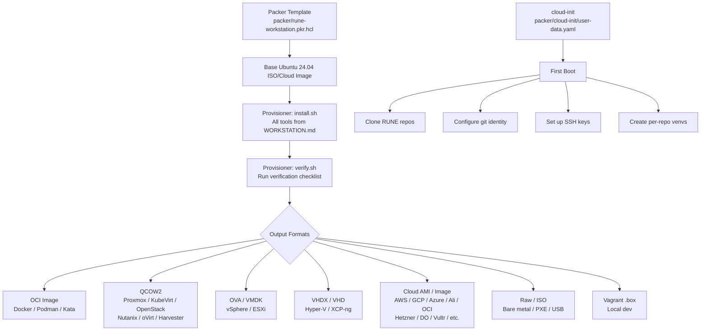

 
# Golden Image — RUNE Developer Workstation

A single Packer source builds a fully provisioned Ubuntu 24.04 LTS developer workstation, pre-loaded with every tool needed for RUNE development. The image is output to every major virtualization, cloud, container, and bare-metal format from one definition.

This approach guarantees:

- **Airgapped/edge compatibility**: The image ships with all tools pre-installed. No network required at boot.
- **Consistency**: Every developer and agent gets the identical environment, regardless of platform.
- **Single source of truth**: One Packer template, one cloud-init config, one verification script. Platform-specific adaptations are output format concerns, not content concerns.

 
## What's in the Image

The golden image contains everything documented in [Workstation Setup](WORKSTATION.md), pre-installed and verified:

| Category | Tools |
|---|---|
| **Python** | Python 3.14, pip, venv |
| **Go** | Go 1.25, gosec v2.22.0, go-licenses v1.6.0, govulncheck |
| **Containers** | Docker Engine, Docker Compose plugin, Podman |
| **Kubernetes** | kubectl v1.35.3, Kind, Helm 3 |
| **Security scanners** | Gitleaks 8.24.3, ShellCheck |
| **Scanner images** (pre-pulled) | anchore/syft:v1.17.0, anchore/grype:v0.82.0, aquasec/trivy:0.65.0 |
| **Editors** | vim, nano (minimal; developers add their own IDE) |
| **Utilities** | git, curl, wget, jq, unzip, yamllint, ca-certificates |

The image does **not** contain:

- RUNE source code (cloned at first boot via cloud-init)
- Secrets, API keys, or SSH keys (injected at first boot)
- IDE or desktop environment (headless server image)

 
## Platform Output Matrix

Packer builds the image once and outputs to all target formats. Each row is a `packer build` post-processor or builder.

### Containers

| Platform | Format | Packer builder/post-processor | Notes |
|---|---|---|---|
| **Docker** | OCI image | `docker` builder | Pushed to GHCR or local registry |
| **Podman** | OCI image | Same OCI image as Docker | Podman pulls from any OCI registry |

### Kubernetes

| Platform | Format | Packer builder/post-processor | Notes |
|---|---|---|---|
| **KubeVirt** | QCOW2 → PVC | `qemu` builder | Import via `virtctl image-upload` or CDI DataVolume |
| **Kata Containers** | OCI image | Same OCI image | Kata runs OCI images with VM isolation |

### On-Premises Hypervisors

| Platform | Format | Packer builder/post-processor | Notes |
|---|---|---|---|
| **Proxmox VE** | QCOW2 | `proxmox-iso` builder | Creates template directly via Proxmox API |
| **VMware vSphere / ESXi** | OVA / VMDK | `vsphere-iso` builder | Deploys via vCenter; export as OVA for offline |
| **Nutanix AHV** | QCOW2 | `nutanix` builder | Uploads via Prism Central API |
| **Microsoft Hyper-V** | VHDX | `hyperv-iso` builder | Native Hyper-V builder |
| **XCP-ng / XenServer** | VHD / XVA | `qemu` builder + convert | Build QCOW2, convert to VHD with `qemu-img` |
| **oVirt / RHV** | QCOW2 | `qemu` builder | Upload via oVirt Engine API |
| **SUSE Harvester** | QCOW2 | `qemu` builder | Import as VM image in Harvester UI |

### On-Premises Cloud Platforms

| Platform | Format | Packer builder/post-processor | Notes |
|---|---|---|---|
| **OpenStack** | QCOW2 | `openstack` builder | Creates Glance image directly |
| **Apache CloudStack** | QCOW2 / OVA | `qemu` builder | Register via CloudStack API |
| **Canonical MAAS** | Custom image | `qemu` builder + `maas` upload | For bare-metal provisioning at scale |

### Public Cloud

| Platform | Format | Packer builder/post-processor | Notes |
|---|---|---|---|
| **AWS** | AMI | `amazon-ebs` builder | Multi-region AMI copy supported |
| **Google Cloud** | GCE image | `googlecompute` builder | Stored in project image family |
| **Microsoft Azure** | VHD / Managed Image | `azure-arm` builder | Published to Shared Image Gallery |
| **Alibaba Cloud** | Custom image | `alicloud-ecs` builder | Multi-region copy supported |
| **Oracle Cloud (OCI)** | Custom image | `oracle-oci` builder | Stored in compartment |
| **Hetzner Cloud** | Snapshot | `hcloud` builder | Snapshot-based, no custom image API |
| **DigitalOcean** | Snapshot | `digitalocean` builder | Snapshot from droplet |
| **Vultr** | Snapshot | `vultr` builder | Snapshot from instance |
| **Linode (Akamai)** | Image | `linode` builder | Custom image upload |
| **Scaleway** | Image | `scaleway` builder | Stored in account images |
| **OVHcloud** | Snapshot | `openstack` builder | OVHcloud uses OpenStack APIs |
| **Tencent Cloud** | Custom image | `tencentcloud-cvm` builder | Multi-region copy supported |
| **Huawei Cloud** | Custom image | `huaweicloud-ecs` builder | IMS image service |
| **IBM Cloud** | Custom image | `ibmcloud-vpc` builder | VPC custom images |
| **Exoscale** | Template | `exoscale` builder | Snapshot-based |
| **UpCloud** | Template | `upcloud` builder | Storage-based templates |

### Edge and Bare Metal

| Platform | Format | Packer builder/post-processor | Notes |
|---|---|---|---|
| **Bare metal (PXE)** | Raw disk / ISO | `qemu` builder + raw convert | PXE boot via MAAS, Tinkerbell, or Ironic |
| **Vagrant** | .box | `vagrant` post-processor | For local dev on any Vagrant provider |
| **Raspberry Pi / ARM64** | Raw image | `arm` builder or cross-build | ARM64 variant for edge devices |
| **USB/SD bootable** | Raw image | `qemu` → `dd`-able image | For airgapped field deployment |

 
## Architecture



 
## Packer Template Structure

All Packer files live in `rune-airgapped/packer/workstation/`:

```
rune-airgapped/packer/workstation/
  rune-workstation.pkr.hcl       # Main template — variables, sources, build blocks
  variables.auto.pkrvars.hcl      # Default variable values (versions, image names)
  scripts/
    install.sh                    # Installs all tools (mirrors WORKSTATION.md exactly)
    verify.sh                     # Runs verification checklist, fails build on error
    cleanup.sh                    # Zeros free space, cleans apt cache, truncates logs
  cloud-init/
    user-data.yaml                # First-boot personalization (repos, keys, git config)
    meta-data.yaml                # Instance metadata template
  output/                         # Build artifacts (gitignored)
```

 
## install.sh — The Single Source of Truth

`install.sh` is the script that provisions the image. It must be kept in sync with [Workstation Setup](WORKSTATION.md). The script is idempotent — running it twice produces the same result.

Key sections:

1. **System update**: `apt-get update && apt-get upgrade -y`
2. **Base packages**: build-essential, curl, wget, git, jq, unzip, ca-certificates, gnupg
3. **Python 3.14**: deadsnakes PPA, python3.14, python3.14-venv, python3.14-dev
4. **Go 1.25**: Binary install to `/usr/local/go`
5. **Go tools**: gosec v2.22.0, go-licenses v1.6.0, govulncheck
6. **Docker Engine**: Official Docker repo, docker-ce, compose plugin, buildx plugin
7. **kubectl v1.35.3**: Binary install to `/usr/local/bin`
8. **Kind**: Binary install to `/usr/local/bin`
9. **Helm 3**: Official install script
10. **Gitleaks 8.24.3**: Binary install to `/usr/local/bin`
11. **ShellCheck**: apt-get install
12. **yamllint**: apt-get install
13. **Pre-pull scanner images**: `docker pull` for syft, grype, trivy
14. **Podman**: apt-get install (for environments that prefer rootless containers)

 
## verify.sh — Build-Time Validation

Runs the same verification checklist from [Workstation Setup](WORKSTATION.md). If any tool is missing or at the wrong version, the Packer build fails.

```bash
#!/usr/bin/env bash
set -euo pipefail

check() { command -v "$1" >/dev/null 2>&1 || { echo "MISSING: $1"; exit 1; } }

check python3.14
check go
check docker
check kubectl
check kind
check helm
check shellcheck
check gitleaks
check yamllint
check podman

# Version checks
python3.14 --version | grep -q "3.14" || { echo "Wrong Python version"; exit 1; }
go version | grep -q "go1.25" || { echo "Wrong Go version"; exit 1; }
kubectl version --client 2>/dev/null | grep -q "v1.35" || { echo "Wrong kubectl version"; exit 1; }
gitleaks version 2>/dev/null | grep -q "8.24.3" || { echo "Wrong gitleaks version"; exit 1; }

# Docker scanner images pre-pulled
docker image inspect anchore/syft:v1.17.0 >/dev/null 2>&1 || { echo "MISSING: syft image"; exit 1; }
docker image inspect anchore/grype:v0.82.0 >/dev/null 2>&1 || { echo "MISSING: grype image"; exit 1; }
docker image inspect aquasec/trivy:0.65.0 >/dev/null 2>&1 || { echo "MISSING: trivy image"; exit 1; }

echo "All checks passed."
```

 
## cloud-init — First Boot Personalization

The golden image is generic. First-boot personalization is handled by cloud-init, which every platform in the matrix supports (natively or via injection).

```yaml
#cloud-config

# Set by the platform or user at deploy time
hostname: rune-dev-01

users:
  - name: rune
    groups: [docker, sudo]
    shell: /bin/bash
    sudo: ALL=(ALL) NOPASSWD:ALL
    ssh_authorized_keys:
      - ${SSH_PUBLIC_KEY}

write_files:
  - path: /home/rune/.gitconfig
    owner: rune:rune
    content: |
      [user]
        name = ${GIT_NAME}
        email = ${GIT_EMAIL}

runcmd:
  - su - rune -c "mkdir -p ~/Devel && cd ~/Devel && git clone https://github.com/lpasquali/rune.git"
  - su - rune -c "cd ~/Devel && git clone https://github.com/lpasquali/rune-operator.git"
  - su - rune -c "cd ~/Devel && git clone https://github.com/lpasquali/rune-ui.git"
  - su - rune -c "cd ~/Devel && git clone https://github.com/lpasquali/rune-charts.git"
  - su - rune -c "cd ~/Devel && git clone https://github.com/lpasquali/rune-docs.git"
  - su - rune -c "cd ~/Devel && git clone https://github.com/lpasquali/rune-audit.git"
  - su - rune -c "cd ~/Devel && git clone https://github.com/lpasquali/rune-airgapped.git"
  # Set up Python venvs for each repo
  - su - rune -c "cd ~/Devel/rune && python3.14 -m venv .venv && . .venv/bin/activate && pip install -e '.[dev]'"
  - su - rune -c "cd ~/Devel/rune-ui && python3.14 -m venv .venv && . .venv/bin/activate && pip install -r requirements.txt"
  - su - rune -c "cd ~/Devel/rune-docs && python3.14 -m venv .venv && . .venv/bin/activate && pip install -r requirements.txt"
  # Go module download for operator
  - su - rune -c "cd ~/Devel/rune-operator && go mod download"
```

For **airgapped deployments**, the cloud-init `runcmd` section is replaced with a tarball extraction step — repos and pip wheels are bundled into the image at build time.

 
## Building the Image

### All platforms (local QCOW2)

```bash
cd rune-airgapped/packer/workstation
packer init .
packer build -only='qemu.rune-workstation' .
# Output: output/rune-workstation.qcow2
```

### Specific platform examples

```bash
# AWS AMI (all regions)
packer build -only='amazon-ebs.rune-workstation' .

# vSphere OVA
packer build -only='vsphere-iso.rune-workstation' .

# Docker OCI image
packer build -only='docker.rune-workstation' .

# Proxmox template
packer build -only='proxmox-iso.rune-workstation' \
  -var 'proxmox_url=https://pve.example.com:8006/api2/json' \
  -var 'proxmox_token=root@pam!packer=...' .

# All platforms at once
packer build .
```

### Conversion for platforms without native Packer builders

```bash
# QCOW2 → VHD (XCP-ng, Hyper-V fallback)
qemu-img convert -f qcow2 -O vpc output/rune-workstation.qcow2 output/rune-workstation.vhd

# QCOW2 → VHDX (Hyper-V native)
qemu-img convert -f qcow2 -O vhdx output/rune-workstation.qcow2 output/rune-workstation.vhdx

# QCOW2 → VMDK (vSphere import fallback)
qemu-img convert -f qcow2 -O vmdk output/rune-workstation.qcow2 output/rune-workstation.vmdk

# QCOW2 → RAW (bare metal, USB, dd)
qemu-img convert -f qcow2 -O raw output/rune-workstation.qcow2 output/rune-workstation.raw
```

 
## Airgapped Variant

For environments with no network access, the image must include:

- All 7 RUNE repos (pre-cloned at a pinned commit)
- Python wheels for all `requirements.txt` files (pre-downloaded)
- Go module cache for `rune-operator` (pre-downloaded)
- Docker images for the scanner toolchain (pre-pulled and saved)
- Ollama binary and at least one model (for local testing)

The airgapped variant is built with an additional Packer variable:

```bash
packer build -var 'airgapped=true' .
```

This triggers additional provisioner steps that bundle everything into the image. The resulting image is larger (~15-20 GB vs ~5 GB for the connected variant) but fully self-contained.

 
## Licensing

Packer is licensed under BSL 1.1 (Business Source License) and is used as a **build-time tool only** — it is not bundled, redistributed, or included in any RUNE artifact. The golden image outputs (QCOW2, OVA, AMI, Docker image, etc.) contain no Packer code and are fully compatible with the project's Apache-2.0 license.

This is the same model used for other build-time dependencies: Docker, Grype, Trivy, and Syft are all used to produce RUNE artifacts but are not shipped with them.

 
## Version Pinning and Updates

All tool versions are defined as Packer variables in `variables.auto.pkrvars.hcl`:

```hcl
python_version     = "3.14"
go_version         = "1.25.0"
kubectl_version    = "v1.35.3"
kind_version       = "v0.27.0"
gitleaks_version   = "8.24.3"
syft_version       = "v1.17.0"
grype_version      = "v0.82.0"
trivy_version      = "0.65.0"
gosec_version      = "v2.22.0"
go_licenses_version = "v1.6.0"
```

When a version is bumped:

1. Update `variables.auto.pkrvars.hcl`
2. Update [Workstation Setup](WORKSTATION.md) to match
3. Update the relevant CI workflow(s)
4. Rebuild the image: `packer build .`

The version variables are the single source of truth for tool versions in the image. `WORKSTATION.md` documents the same versions for manual installation.

 
## Platform-Specific Notes

### Docker

The Docker image is a development environment, not a minimal runtime container. It includes a full init system (systemd or tini) to support Docker-in-Docker for the scanner toolchain and Kind for Kubernetes testing. Use `--privileged` or configure appropriate security capabilities.

### KubeVirt

Import the QCOW2 as a DataVolume:
```yaml
apiVersion: cdi.kubevirt.io/v1beta1
kind: DataVolume
metadata:
  name: rune-workstation
spec:
  source:
    http:
      url: "https://artifacts.example.com/rune-workstation.qcow2"
  pvc:
    accessModes: [ReadWriteOnce]
    resources:
      requests:
        storage: 30Gi
```

### Proxmox

The `proxmox-iso` builder creates a VM template directly. Clone it via the Proxmox UI or API. cloud-init drive is attached automatically.

### vSphere

Export the VM as an OVA for offline distribution. Import via "Deploy OVF Template" in the vSphere Client.

### Nutanix

Upload the QCOW2 via Prism Central → Images. Create a VM from the image. Nutanix supports cloud-init natively via "Guest Customization."

### Bare Metal / PXE

Convert to raw format and serve via MAAS, Tinkerbell, or Ironic. The image supports both BIOS and UEFI boot (configured in the Packer template).

### ARM64 (Raspberry Pi, Graviton, Ampere)

An ARM64 variant is built using the `aarch64` Ubuntu cloud image as the base. All tools have ARM64 builds. The Go and Python toolchains are architecture-aware. Docker multi-arch images for the scanners are pulled for `linux/arm64`.
