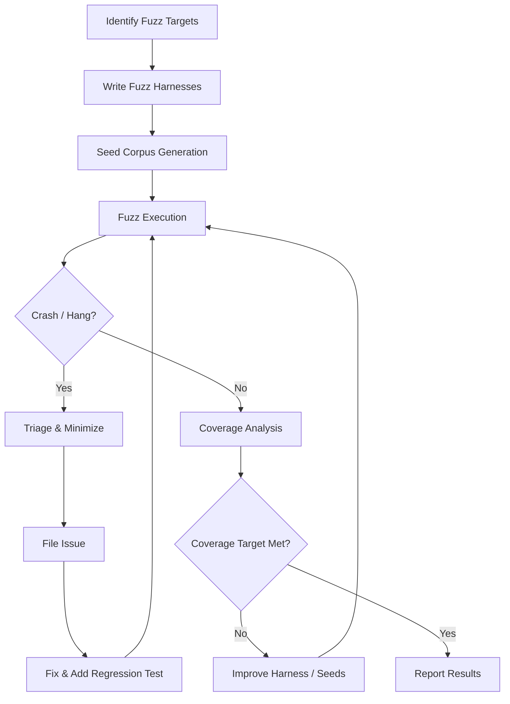

# Fuzz Testing Program

**IEC 62443-4-1 SVV-5 Compliance**

## 1. Purpose

This document defines the fuzz testing program for the RUNE platform, satisfying
IEC 62443-4-1 SVV-5 requirements for robustness testing through automated input
generation. Fuzz testing complements the penetration testing program
([PENTEST.md](PENTEST.md)) by discovering input-handling defects that manual
testing may miss.

## 2. Scope

### 2.1 Fuzz Targets

| Target | Repository | Language | Priority | Rationale |
|---|---|---|---|---|
| REST API endpoints | `rune` | Python | Critical | Public-facing attack surface |
| DriverTransport protocol parser | `rune` | Python | Critical | Inter-process boundary; arbitrary input from drivers |
| YAML configuration parser (`rune.yaml`) | `rune` | Python | High | User-supplied configuration files |
| AgentRunner input handling | `rune` | Python | High | Processes untrusted agent output |
| LLM response parser | `rune` | Python | Medium | Handles unpredictable LLM output formats |
| Kubernetes CRD validation | `rune-operator` | Go | High | Admission control for custom resources |
| Helm values schema | `rune-charts` | YAML | Medium | User-supplied deployment configuration |

### 2.2 Out-of-Scope

- Third-party library internals (covered by SCA/CVE scanning).
- UI rendering (covered by browser-level testing).

## 3. Tools

| Tool | Language | Target | Integration |
|---|---|---|---|
| **Hypothesis** | Python | `rune` API, DriverTransport, YAML parsing | pytest plugin; runs in CI |
| **go-fuzz** / **native Go fuzzing** | Go | `rune-operator` CRD validation | `go test -fuzz`; runs in CI |
| **RESTler** | Python | REST API stateful fuzzing | Scheduled job (weekly) |
| **AFL++** | C/Python | Low-level protocol parsing (if applicable) | Manual / scheduled |

## 4. Methodology



### 4.1 Harness Design Principles

1. **Isolation**: Each fuzz harness tests a single parser or handler in
   isolation, with all external dependencies mocked.
2. **Determinism**: No network calls, no filesystem side effects, no
   randomness outside the fuzzer's control.
3. **Speed**: Target > 1000 executions/second per harness to ensure meaningful
   coverage within CI time budgets.

### 4.2 Seed Corpus

- Valid inputs from test fixtures and real-world usage.
- Edge cases from past bug reports.
- Malformed inputs from OWASP attack payloads.

## 5. CI Integration

### 5.1 Python (Hypothesis)

Hypothesis-based property tests run as part of the standard `pytest` suite:

```yaml
# In rune CI pipeline
- name: Run fuzz tests
  run: |
    pytest tests/fuzz/ \
      --hypothesis-seed=0 \
      -x \
      --timeout=300
```

The `--hypothesis-seed=0` flag ensures reproducibility in CI. Local development
uses randomized seeds for broader exploration.

### 5.2 Go (Native Fuzzing)

Go fuzz tests run in a dedicated CI step with a time budget:

```yaml
# In rune-operator CI pipeline
- name: Run fuzz tests
  run: |
    go test ./... -fuzz=. -fuzztime=120s
```

### 5.3 Scheduled Deep Fuzzing

Weekly scheduled jobs run extended fuzzing sessions (4 hours) against all
targets. Results are uploaded as CI artifacts.

## 6. Coverage Targets

| Target | Minimum Line Coverage | Minimum Branch Coverage |
|---|---|---|
| REST API input parsing | 90% | 80% |
| DriverTransport protocol | 95% | 85% |
| YAML config parser | 90% | 80% |
| CRD validation (Go) | 90% | 80% |

Coverage is measured using the fuzzer's built-in instrumentation and reported
alongside standard test coverage metrics.

## 7. Reporting

### 7.1 Per-Run Report

Each fuzz run (CI or scheduled) produces:

- Number of executions.
- Unique crashes / hangs discovered.
- Code coverage achieved.
- New corpus entries generated.

### 7.2 Defect Classification

| Category | Description | Action |
|---|---|---|
| **Crash** | Unhandled exception or segfault | P0/P1 issue; fix within SLA |
| **Hang** | Execution exceeds timeout (10x median) | P2 issue; investigate |
| **Memory** | Excessive allocation or leak | P2 issue; investigate |
| **Logic** | Assertion violation in property test | P2/P3 issue; fix and add regression test |

Remediation SLAs follow the penetration testing program
([PENTEST.md](PENTEST.md#7-remediation-sla)).

### 7.3 Historical Results

> **Placeholder**: Fuzz testing infrastructure is being established. First
> results expected Q2 2026.

## 8. References

- [IEC 62443-4-1:2018](https://webstore.iec.ch/publication/33615) SVV-5 -- Fuzz testing
- [SDL.md](SDL.md) -- Security Development Lifecycle
- [PENTEST.md](PENTEST.md) -- Penetration testing program
- [RISK_ASSESSMENT.md](RISK_ASSESSMENT.md) -- Threat model informing fuzz targets
- [Hypothesis](https://hypothesis.readthedocs.io/) -- Python property-based testing
- [Go native fuzzing](https://go.dev/doc/security/fuzz/)
- [External Links Catalog](../reference/EXTERNAL_LINKS.md) -- Complete list of standards and tools
