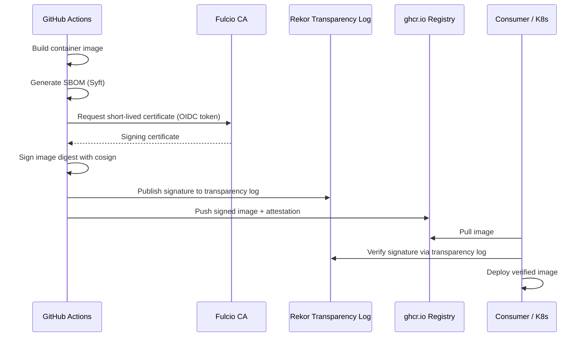

# Container Image Signing

**SLSA L3 Compliance**

## 1. Purpose

This document defines the plan for cryptographic signing of RUNE container
images using cosign with keyless signing (Fulcio/Rekor). This satisfies
SLSA Level 3 requirements for tamper-proof provenance and enables consumers
to verify image authenticity before deployment.

## 2. Architecture



## 3. Signing Workflow

### 3.1 Key Management: Keyless Signing

RUNE uses **keyless signing** via the Sigstore ecosystem to eliminate key
management overhead and reduce the risk of key compromise:

| Component | Role |
|---|---|
| **Fulcio** | Issues short-lived X.509 certificates bound to the CI workload's OIDC identity |
| **Rekor** | Immutable transparency log; records all signing events for public audit |
| **cosign** | Signs OCI images and verifies signatures |

No long-lived signing keys are stored or managed. The OIDC identity of the
GitHub Actions workflow serves as the trust anchor.

### 3.2 CI Integration

The following step is added to the `quality-gates.yml` pipeline after the
image build and SBOM generation:

```yaml
  sign-image:
    name: RuneGate/Security/ImageSigning
    needs: [build-image, security-sbom]
    if: github.event_name == 'push' && github.ref == 'refs/heads/main'
    runs-on: ubuntu-latest
    permissions:
      id-token: write    # Required for Fulcio OIDC
      packages: write    # Required to push signature to GHCR
      contents: read
    steps:
      - uses: sigstore/cosign-installer@v3

      - name: Sign container image
        env:
          IMAGE: ghcr.io/${{ github.repository_owner }}/${{ github.event.repository.name }}
          DIGEST: ${{ needs.build-image.outputs.digest }}
        run: |
          cosign sign --yes "${IMAGE}@${DIGEST}"

      - name: Attach SBOM attestation
        env:
          IMAGE: ghcr.io/${{ github.repository_owner }}/${{ github.event.repository.name }}
          DIGEST: ${{ needs.build-image.outputs.digest }}
        run: |
          cosign attest --yes \
            --predicate sbom/rune-docs-image.cdx.json \
            --type cyclonedx \
            "${IMAGE}@${DIGEST}"
```

### 3.3 Signing Scope

| Artifact | Signed | Method |
|---|---|---|
| Container images (all repos) | Yes | cosign keyless (Fulcio/Rekor) |
| SBOM attestation | Yes | cosign attest (CycloneDX predicate) |
| Build provenance (SLSA) | Yes | `actions/attest-build-provenance` (existing) |
| Helm charts | Planned | cosign (future milestone) |
| Git commits | Required by policy | GPG / SSH signing |

## 4. Verification Commands

Consumers can verify RUNE container images using the following commands.

### 4.1 Verify Image Signature

```bash
# Verify the image was signed by the RUNE CI pipeline
cosign verify \
  --certificate-oidc-issuer https://token.actions.githubusercontent.com \
  --certificate-identity-regexp "https://github.com/lpasquali/.*/.github/workflows/.*" \
  ghcr.io/lpasquali/rune-docs:latest
```

### 4.2 Verify SBOM Attestation

```bash
# Verify and extract the SBOM attestation
cosign verify-attestation \
  --certificate-oidc-issuer https://token.actions.githubusercontent.com \
  --certificate-identity-regexp "https://github.com/lpasquali/.*/.github/workflows/.*" \
  --type cyclonedx \
  ghcr.io/lpasquali/rune-docs:latest
```

### 4.3 Verify Build Provenance

```bash
# Verify SLSA provenance (via GitHub's built-in attestation)
gh attestation verify \
  oci://ghcr.io/lpasquali/rune-docs:latest \
  --owner lpasquali
```

## 5. Kubernetes Policy Enforcement

To enforce that only signed images are deployed, configure an admission
controller:

### 5.1 Kyverno Policy (Recommended)

```yaml
apiVersion: kyverno.io/v1
kind: ClusterPolicy
metadata:
  name: verify-rune-image-signatures
spec:
  validationFailureAction: Enforce
  rules:
    - name: verify-cosign-signature
      match:
        any:
          - resources:
              kinds:
                - Pod
      verifyImages:
        - imageReferences:
            - "ghcr.io/lpasquali/*"
          attestors:
            - entries:
                - keyless:
                    issuer: "https://token.actions.githubusercontent.com"
                    subject: "https://github.com/lpasquali/*"
```

### 5.2 Sigstore Policy Controller (Alternative)

The Sigstore policy-controller can be used as a drop-in alternative in clusters
where Kyverno is not deployed.

## 6. Integration Points in quality-gates.yml

| Existing Job | Integration |
|---|---|
| `build-image` | Outputs image digest for signing |
| `security-sbom` | Produces SBOM used as attestation predicate |
| `sign-image` (new) | Signs image and attaches SBOM attestation |
| `merge-gate` | Updated `needs` to include `sign-image` |

The signing job runs only on pushes to `main` (not on PRs) to avoid signing
unreviewed code.

## 7. Rollout Plan

| Phase | Milestone | Status |
|---|---|---|
| 1. Document signing architecture | Current PR | In Progress |
| 2. Add `cosign-installer` to CI | Next milestone | Planned |
| 3. Enable keyless signing on `rune-docs` | Next milestone | Planned |
| 4. Roll out to `rune`, `rune-operator`, `rune-ui` | Following milestone | Planned |
| 5. Enable Kyverno admission policy in kind/production | Following milestone | Planned |
| 6. Sign Helm charts | Future | Planned |

## 8. Risk Mitigation

This document addresses risk R-005 (unsigned container images) in the
[RISK_REGISTER.md](RISK_REGISTER.md). Once fully implemented, the risk score
will be reassessed from 15 (High) to an expected 4 (Low).

## 9. References

- [SLSA v1.0](https://slsa.dev/spec/v1.0/) -- Supply-chain Levels for Software Artifacts
- [SLSA Provenance v1](https://slsa.dev/spec/v1.0/provenance) -- Attestation format
- [Sigstore documentation](https://docs.sigstore.dev/)
- [cosign](https://docs.sigstore.dev/cosign/overview/)
- [Rekor](https://docs.sigstore.dev/logging/overview/) -- Transparency log
- [SPDX](https://spdx.dev/) -- SBOM format
- [External Links Catalog](../reference/EXTERNAL_LINKS.md) -- Complete list of standards and tools
- [SDL.md](SDL.md) -- Security Development Lifecycle
- [RISK_REGISTER.md](RISK_REGISTER.md) -- Risk R-005
- [RISK_ASSESSMENT.md](RISK_ASSESSMENT.md) -- Threat modeling methodology
- [SYSTEM_PROMPT.md](../context/SYSTEM_PROMPT.md) -- SLSA L3 requirement
