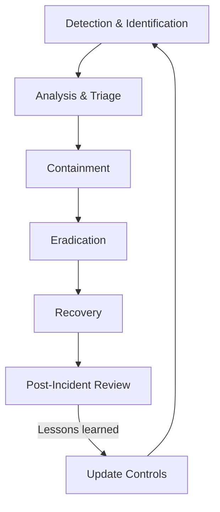

# Incident Response Plan

**IEC 62443-4-1 DM-2 / NIST CSF RS Compliance**

## 1. Purpose

This document defines the formal Incident Response Plan (IRP) for the RUNE
platform. It establishes procedures for detecting, analyzing, containing,
eradicating, and recovering from security incidents, satisfying IEC 62443-4-1
DM-2 (Defect Management) and NIST Cybersecurity Framework Respond (RS)
requirements.

## 2. Scope

This plan covers security incidents affecting:

- All RUNE repositories and their CI/CD pipelines.
- Deployed RUNE instances (Kubernetes, docker-compose, standalone CLI).
- Third-party integrations (Vast.ai, Ollama, LLM backends).
- Documentation and supply chain artifacts.

## 3. Severity Classification

| Level | Name | Description | Examples | Response Time |
|---|---|---|---|---|
| **P0** | Critical | Active exploitation or imminent data breach | RCE in production, secrets leaked to public repo, supply chain compromise | Immediate (< 1 hour) |
| **P1** | High | Exploitable vulnerability with no active exploitation | Auth bypass discovered, CVSS >= 9.0 finding, unsigned release published | < 4 hours |
| **P2** | Medium | Vulnerability requiring specific conditions to exploit | CVSS 7.0-8.9 finding, misconfigured RBAC, dependency with known CVE | < 24 hours |
| **P3** | Low | Minor security issue with limited impact | Informational disclosure, CVSS < 4.0, non-sensitive log exposure | < 7 days |

## 4. Roles

| Role | Responsibility | Assignment |
|---|---|---|
| **Incident Commander (IC)** | Overall coordination; declares severity; authorizes containment actions | `lpasquali` (primary) |
| **Security Lead** | Technical investigation; forensic analysis; recommends remediation | Designated per incident |
| **Communications Lead** | Stakeholder notification; public disclosure coordination | IC (solo project) or designated |
| **Scribe** | Documents timeline, decisions, and actions in real-time | Assigned at incident start |

For a solo-engineer project, `lpasquali` fills all roles. As the team grows,
roles are delegated per the table above.

## 5. Incident Response Phases



### 5.1 Detection and Identification

**Sources**:

- GitHub Dependabot / Security Advisories.
- CI pipeline failures (SAST, SCA, secret scanning, CVE policy gate).
- Gitleaks alerts.
- External vulnerability reports (via GitHub Security Advisories).
- Runtime monitoring and observability alerts (see `operations/OBSERVABILITY.md`).

**Actions**:

1. Acknowledge the alert within the response time for the assessed severity.
2. Create a private GitHub Security Advisory (for P0/P1) or issue (for P2/P3).
3. Assign the Incident Commander.

### 5.2 Analysis and Triage

1. Confirm the incident is genuine (eliminate false positives).
2. Determine scope: which repositories, versions, and deployments are affected.
3. Assess severity using the classification table above.
4. Identify the attack vector and affected data.

### 5.3 Containment

**Short-term containment** (stop the bleeding):

- Revoke compromised credentials immediately.
- Disable affected endpoints or features via feature flags or emergency patch.
- Block malicious IPs or network paths if applicable.
- Pin or revert compromised dependencies.

**Long-term containment** (stabilize):

- Deploy patched versions to all affected environments.
- Rotate all potentially compromised secrets.
- Enable enhanced monitoring on affected components.

### 5.4 Eradication

1. Identify and remove the root cause (vulnerable code, misconfiguration,
   compromised dependency).
2. Apply the fix across all affected repositories.
3. Verify the fix via the standard CI pipeline (SAST, SCA, tests).
4. Update the VEX register if a known vulnerability was involved.

### 5.5 Recovery

1. Redeploy affected services from verified, signed artifacts.
2. Verify container image signatures (see [IMAGE_SIGNING.md](IMAGE_SIGNING.md)).
3. Confirm all systems are operating normally via observability dashboards.
4. Remove temporary containment measures (IP blocks, disabled features).

### 5.6 Post-Incident Review

Conduct within **5 business days** of incident resolution:

1. Timeline reconstruction.
2. Root cause analysis (5 Whys or Fishbone).
3. Identify control gaps.
4. Document lessons learned.
5. Create follow-up issues for process improvements.
6. Update the risk register ([RISK_REGISTER.md](RISK_REGISTER.md)).
7. Update this IRP if process gaps were identified.

## 6. Communication Templates

### 6.1 Internal Notification (P0/P1)

```
Subject: [RUNE Security Incident] P{0|1} - {Brief Description}

Severity: P{0|1}
Status: {Investigating | Contained | Resolved}
Incident Commander: {name}
Affected Components: {list}
Summary: {1-2 sentences}
Current Actions: {what is being done}
Next Update: {time}
```

### 6.2 External Disclosure (if required)

```
Subject: [RUNE Security Advisory] {CVE-ID or title}

Affected Versions: {version range}
Fixed Versions: {version}
Severity: {Critical|High|Medium|Low} (CVSS: {score})
Description: {detailed description}
Remediation: {upgrade instructions}
Timeline: {discovery date, fix date, disclosure date}
Credit: {reporter, if applicable}
```

## 7. Regulatory Notification Requirements

| Regulation | Notification Deadline | Authority |
|---|---|---|
| IEC 62443-4-1 DM-2 | Document and track all defects | Internal |
| GDPR (if personal data involved) | 72 hours | Supervisory authority |
| GitHub Security Advisory | Before public disclosure | GitHub / CVE |

For an open-source project, the primary disclosure mechanism is GitHub Security
Advisories with coordinated disclosure.

## 8. Evidence Preservation

During any P0 or P1 incident:

1. **Do not modify** affected systems before capturing evidence.
2. Capture and archive:
      - CI/CD pipeline logs.
      - Git history (relevant commits and force-pushes).
      - Container image digests and SBOMs.
      - Access logs from GitHub, container registries, and cloud providers.
3. Store evidence in a dedicated, access-controlled location.
4. Maintain chain of custody documentation.

## 9. Post-Incident Review Cadence

| Activity | Frequency |
|---|---|
| Post-incident review | Within 5 business days of resolution |
| IRP tabletop exercise | Quarterly |
| IRP document review | Annually or after any P0/P1 incident |
| Lessons-learned integration into SDL | Continuous |

## 10. References

- IEC 62443-4-1:2018 DM-2 -- Defect management
- NIST Cybersecurity Framework -- Respond (RS)
- NIST SP 800-61r2 -- Computer Security Incident Handling Guide
- [SDL.md](SDL.md) -- Security Development Lifecycle
- [RISK_REGISTER.md](RISK_REGISTER.md) -- Risk register
- [IMAGE_SIGNING.md](IMAGE_SIGNING.md) -- Container image verification
- [SYSTEM_PROMPT.md](../context/SYSTEM_PROMPT.md) -- Vulnerability closure policy
