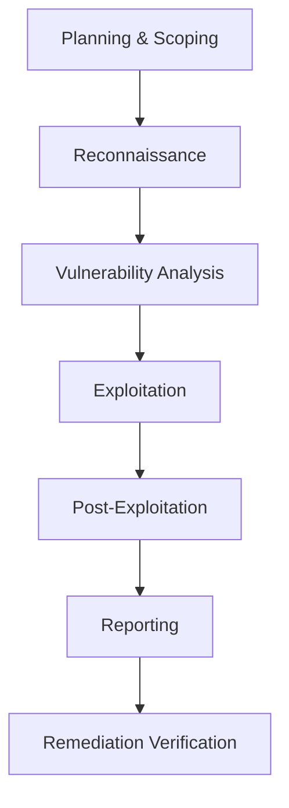

# Penetration Testing Program

**IEC 62443-4-1 SVV-4 Compliance**

## 1. Purpose

This document defines the penetration testing program for the RUNE platform,
satisfying IEC 62443-4-1 SVV-4 requirements for security verification and
validation through adversarial testing.

## 2. Scope

### 2.1 In-Scope Components

| Component | Attack Surface | Priority |
|---|---|---|
| REST API (`rune_bench/api_server.py`) | HTTP endpoints, authentication, authorization | Critical |
| DriverTransport protocol | Inter-process communication, command injection | Critical |
| Kubernetes Operator CRDs | RBAC, admission control, privilege escalation | High |
| Web UI (HTMX) | XSS, CSRF, session management | High |
| Vast.ai provisioning | Cost injection, credential leakage | High |
| Helm chart defaults | Insecure defaults, privilege escalation | Medium |
| MkDocs documentation site | Information disclosure | Low |

### 2.2 Out-of-Scope

- Third-party SaaS infrastructure (GitHub, Vast.ai backend systems).
- Physical security of development workstations.
- Social engineering attacks.

## 3. Frequency

| Trigger | Type | Scope |
|---|---|---|
| Quarterly (Jan, Apr, Jul, Oct) | Scheduled | Full scope |
| Pre-release (before any minor/major version) | Gate | Full scope |
| API or auth schema change | Triggered | Affected component |
| New agent integration | Triggered | DriverTransport + agent boundary |

## 4. Methodology

Testing follows a combination of industry-standard frameworks:

### 4.1 Standards

- **OWASP Testing Guide v4** -- Web application and API testing.
- **PTES (Penetration Testing Execution Standard)** -- Overall methodology.
- **OWASP API Security Top 10** -- API-specific attack vectors.

### 4.2 Test Categories

1. **Authentication and Authorization** -- Token handling, RBAC bypass, privilege escalation.
2. **Input Validation** -- SQL injection, command injection via DriverTransport, YAML deserialization.
3. **API Security** -- Rate limiting, mass assignment, BOLA/BFLA.
4. **Container Security** -- Escape vectors, image tampering, unsigned image acceptance.
5. **Supply Chain** -- Dependency confusion, CI pipeline poisoning, unsigned artifacts.
6. **Configuration** -- Default credentials, overly permissive RBAC, exposed debug endpoints.

## 5. Tools

| Tool | Purpose |
|---|---|
| Burp Suite Professional | Web/API interactive testing |
| OWASP ZAP | Automated web scanning |
| Nuclei | Template-based vulnerability scanning |
| kube-hunter | Kubernetes-specific attack simulation |
| trivy | Container and filesystem scanning |
| grype | SBOM-based vulnerability matching |
| sqlmap | SQL injection testing |
| Custom scripts | DriverTransport protocol fuzzing |

## 6. Reporting Template

Each penetration test produces a report with the following structure:

### 6.1 Executive Summary

- Test date range
- Scope and methodology
- Overall risk rating (Critical / High / Medium / Low)
- Key findings count by severity

### 6.2 Findings

Each finding includes:

| Field | Description |
|---|---|
| ID | Unique identifier (e.g., `PT-2026-Q1-001`) |
| Title | Concise description |
| Severity | Critical / High / Medium / Low / Informational |
| CVSS v3.1 Score | Numeric score |
| Affected Component | Repository, file, or endpoint |
| Description | Detailed explanation |
| Proof of Concept | Steps to reproduce |
| Remediation | Recommended fix |
| References | CWE, OWASP, CVE if applicable |

### 6.3 Remediation Tracking

Findings are tracked as GitHub issues with the `security` label.

## 7. Remediation SLA

| Severity | Remediation Deadline | Retest Deadline |
|---|---|---|
| Critical (CVSS >= 9.0) | 48 hours | 72 hours |
| High (CVSS 7.0-8.9) | 7 calendar days | 14 calendar days |
| Medium (CVSS 4.0-6.9) | 30 calendar days | 45 calendar days |
| Low (CVSS < 4.0) | Next milestone | Next milestone + 30 days |

Findings above CVSS 8.8 with no upstream fix require fork-and-patch per the
vulnerability closure policy in [SYSTEM_PROMPT.md](../context/SYSTEM_PROMPT.md).

## 8. Historical Results

> **Placeholder**: No penetration tests have been conducted yet. The first
> scheduled test is Q2 2026. Results will be recorded in this section as they
> become available.

| Test ID | Date | Scope | Findings (C/H/M/L) | Status |
|---|---|---|---|---|
| PT-2026-Q2-001 | TBD | Full | -- | Scheduled |

## 9. References

- [IEC 62443-4-1:2018](https://webstore.iec.ch/publication/33615) SVV-4 -- Penetration testing
- [OWASP Web Security Testing Guide v4.2](https://owasp.org/www-project-web-security-testing-guide/)
- [PTES](http://www.pentest-standard.org/) -- Penetration Testing Execution Standard
- [OWASP API Security Top 10 (2023)](https://owasp.org/www-project-api-security/)
- [External Links Catalog](../reference/EXTERNAL_LINKS.md) -- Complete list of standards and tools
- [SDL.md](SDL.md) -- Security Development Lifecycle
- [RISK_ASSESSMENT.md](RISK_ASSESSMENT.md) -- Threat model informing test scope
- [FUZZ_TESTING.md](FUZZ_TESTING.md) -- Complementary fuzz testing program
- [INCIDENT_RESPONSE.md](INCIDENT_RESPONSE.md) -- Response process for critical findings
