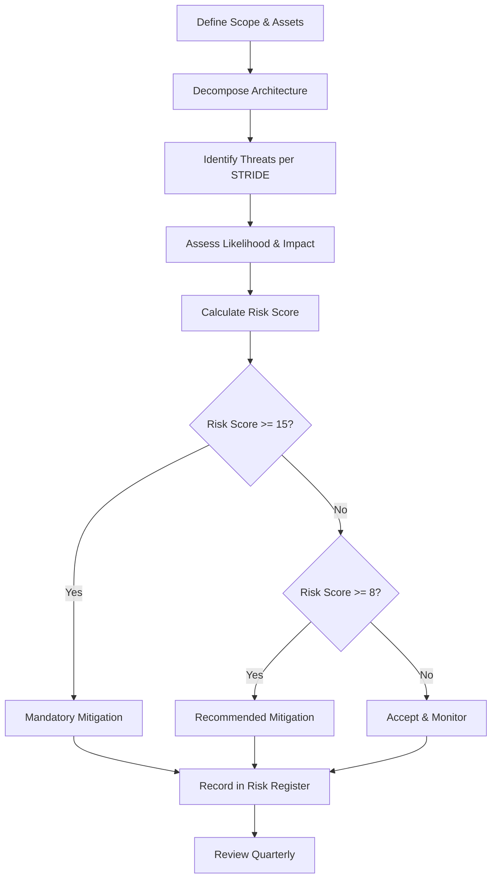
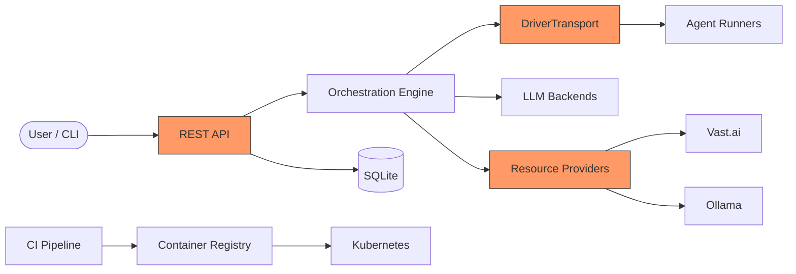

# Risk Assessment Methodology

**IEC 62443-4-1 SM-5 Compliance**

## 1. Purpose

This document defines the risk assessment methodology for the RUNE platform,
satisfying IEC 62443-4-1 SM-5 requirements for a formal risk assessment process.
It establishes how threats are identified, analyzed, and prioritized to inform
security controls throughout the SDL ([SDL.md](SDL.md)).

## 2. Scope

This methodology applies to all RUNE components, infrastructure, and
third-party integrations. It covers:

- Software threats (vulnerabilities, misconfigurations).
- Supply chain threats (dependency compromise, CI pipeline attacks).
- Operational threats (cost overrun, data loss, availability).
- Compliance risks (license contamination, certification gaps).

## 3. Methodology: STRIDE-Based Threat Modeling

RUNE uses the STRIDE threat classification framework, applied systematically
to each architectural component.

### 3.1 STRIDE Categories

| Category | Description | Example in RUNE |
|---|---|---|
| **S**poofing | Impersonating a user or system | Forged API tokens, unsigned container images |
| **T**ampering | Modifying data or code without authorization | CI pipeline poisoning, dependency substitution |
| **R**epudiation | Denying actions without accountability | Unsigned commits, missing audit logs |
| **I**nformation Disclosure | Exposing data to unauthorized parties | Secrets in logs, unencrypted DriverTransport |
| **D**enial of Service | Disrupting availability | Vast.ai cost bomb, resource exhaustion |
| **E**levation of Privilege | Gaining unauthorized access | RBAC bypass in operator, container escape |

### 3.2 Threat Modeling Process

### 3.3 Assessment Criteria

#### Likelihood (1-5)

| Score | Level | Description |
|---|---|---|
| 1 | Rare | Requires highly specialized knowledge and access; no known exploits |
| 2 | Unlikely | Requires significant effort or insider access |
| 3 | Possible | Known attack vector exists; moderate skill required |
| 4 | Likely | Attack is straightforward with publicly available tools |
| 5 | Almost Certain | Actively exploited or trivially exploitable |

#### Impact (1-5)

| Score | Level | Description |
|---|---|---|
| 1 | Negligible | No data loss; minor inconvenience; self-recovering |
| 2 | Minor | Limited data exposure; single-user impact; quick recovery |
| 3 | Moderate | Significant data exposure; service degradation; hours to recover |
| 4 | Major | Broad data breach; extended outage; financial loss (e.g., Vast.ai costs) |
| 5 | Catastrophic | Complete system compromise; irrecoverable data loss; compliance failure |

#### Risk Score

**Risk Score = Likelihood x Impact**

| Score Range | Risk Level | Required Action |
|---|---|---|
| 1-4 | Low | Accept and monitor |
| 5-7 | Low-Medium | Accept with documented justification |
| 8-14 | Medium | Recommended mitigation within next milestone |
| 15-19 | High | Mandatory mitigation; tracked as priority issue |
| 20-25 | Critical | Immediate action; may block release |

### 3.4 Treatment Options

| Treatment | Description | When to Use |
|---|---|---|
| **Mitigate** | Implement controls to reduce likelihood or impact | Default for High/Critical risks |
| **Accept** | Acknowledge the risk with documented justification | Low risks; risks below threshold with no fix |
| **Transfer** | Shift risk to a third party (insurance, SaaS provider) | Infrastructure risks outside project control |
| **Avoid** | Eliminate the threat by removing the feature or dependency | When mitigation cost exceeds feature value |

## 4. Data Flow Diagram

Trust boundaries (highlighted in orange) are the primary targets for threat
modeling: the REST API, DriverTransport protocol, and resource provider
interfaces.

## 5. Review and Update

| Activity | Frequency | Owner |
|---|---|---|
| Full threat model review | Quarterly | Security Lead |
| Risk register update | Quarterly or on significant change | Security Lead |
| Post-incident risk reassessment | After every P0/P1 incident | Incident Commander |
| Methodology review | Annually | Project Owner |

## 6. Outputs

The primary output of this methodology is the **Risk Register**
([RISK_REGISTER.md](RISK_REGISTER.md)), which tracks all identified risks,
their scores, treatment decisions, and review status.

## 7. References

- [IEC 62443-4-1:2018](https://webstore.iec.ch/publication/33615) SM-5 -- Security risk assessment
- [Microsoft STRIDE](https://learn.microsoft.com/en-us/azure/security/develop/threat-modeling-tool-threats) threat model
- [NIST SP 800-30r1](https://csrc.nist.gov/publications/detail/sp/800-30/rev-1/final) -- Guide for Conducting Risk Assessments
- [External Links Catalog](../reference/EXTERNAL_LINKS.md) -- Complete list of standards and tools
- [SDL.md](SDL.md) -- Security Development Lifecycle
- [RISK_REGISTER.md](RISK_REGISTER.md) -- Active risk register
- [PENTEST.md](PENTEST.md) -- Penetration testing (validates risk assessments)
- [SYSTEM_PROMPT.md](../context/SYSTEM_PROMPT.md) -- Architecture and constraints
