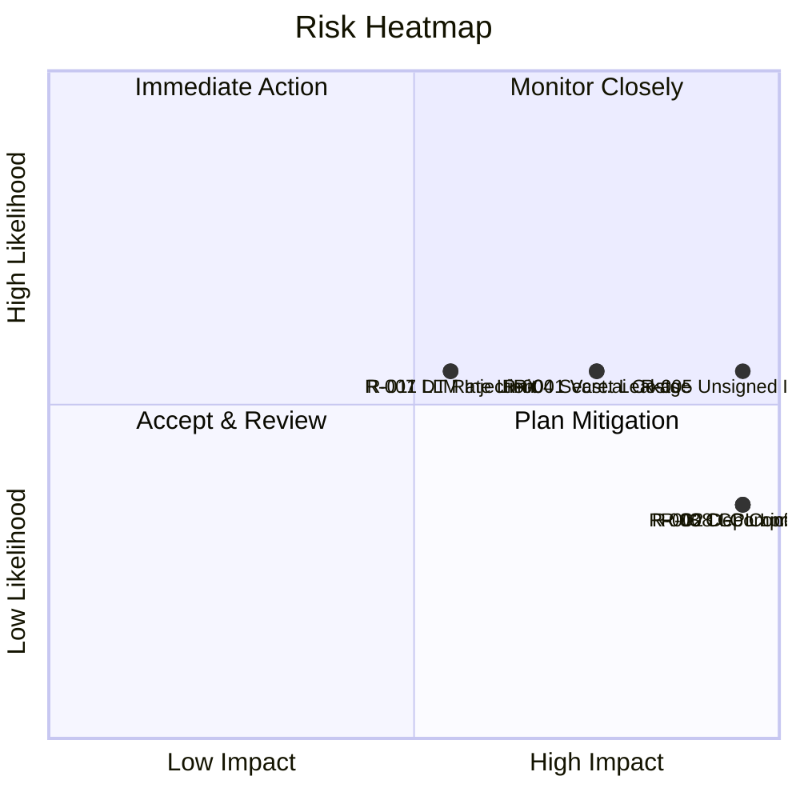

# Risk Register

**IEC 62443-4-1 SM-5 Compliance**

## 1. Purpose

This register tracks all identified security and operational risks for the RUNE
platform. It is the primary output of the risk assessment methodology defined
in [RISK_ASSESSMENT.md](RISK_ASSESSMENT.md). Each risk is scored, assigned a
treatment, and reviewed on a regular cadence.

## 2. Risk Register

<!-- Likelihood (L): 1-5, Impact (I): 1-5, Risk Score (RS) = L x I -->
<!-- Treatment: Accept / Mitigate / Transfer / Avoid -->

| ID | Category | Description | L | I | RS | Treatment | Owner | Status | Review Date |
|---|---|---|---|---|---|---|---|---|---|
| R-001 | Operational / Cost | Vast.ai GPU provisioning costs exceed budget due to misconfigured or runaway instances. Fail-closed cost gate mitigates but does not eliminate risk for manual operations. | 3 | 4 | 12 | Mitigate | lpasquali | Open | 2026-07-01 |
| R-002 | Supply Chain | Dependency confusion or typosquatting attack introduces malicious package into `requirements.txt` or `go.mod`. | 2 | 5 | 10 | Mitigate | lpasquali | Open | 2026-07-01 |
| R-003 | Supply Chain | CI pipeline compromise (GitHub Actions workflow injection, compromised action). | 2 | 5 | 10 | Mitigate | lpasquali | Open | 2026-07-01 |
| R-004 | Information Disclosure | Secrets (API tokens, Vast.ai keys) leaked via logs, error messages, or misconfigured environment. Policy mandates env-var-only storage, but human error remains possible. | 3 | 4 | 12 | Mitigate | lpasquali | Open | 2026-07-01 |
| R-005 | Tampering | Unsigned container images accepted by Kubernetes cluster, allowing deployment of tampered artifacts. See [IMAGE_SIGNING.md](IMAGE_SIGNING.md) for planned mitigation. | 3 | 5 | 15 | Mitigate | lpasquali | Open | 2026-07-01 |
| R-006 | Elevation of Privilege | Kubernetes RBAC misconfiguration in rune-operator grants excessive permissions to workloads. | 2 | 4 | 8 | Mitigate | lpasquali | Open | 2026-07-01 |
| R-007 | Denial of Service | DriverTransport protocol lacks rate limiting; malicious or buggy driver could flood the orchestrator. | 3 | 3 | 9 | Mitigate | lpasquali | Open | 2026-07-01 |
| R-008 | Compliance / Legal | GPL-2.0 licensed dependency introduced without CI detection. License gate updated to block GPL-2.0 variants (see quality-gates.yml). | 2 | 5 | 10 | Mitigate | lpasquali | Mitigated | 2026-07-01 |
| R-009 | Information Disclosure | SQLite database in Kubernetes lacks encryption at rest; persistent volume could be accessed if node is compromised. | 2 | 3 | 6 | Accept | lpasquali | Accepted | 2026-07-01 |
| R-010 | Spoofing | Unsigned Git commits could be injected if branch protection is misconfigured. Signed commits are required by policy but not enforced by all repos yet. | 2 | 4 | 8 | Mitigate | lpasquali | Open | 2026-07-01 |
| R-011 | Tampering | LLM response injection -- malicious LLM output could manipulate agent behavior or produce misleading benchmark results. | 3 | 3 | 9 | Mitigate | lpasquali | Open | 2026-07-01 |
| R-012 | Repudiation | Incomplete audit trail for Vast.ai instance lifecycle events; manual operations are not logged. | 3 | 3 | 9 | Mitigate | lpasquali | Open | 2026-07-01 |
| R-013 | Denial of Service | MkDocs documentation site denial of service via resource exhaustion (low impact; static site behind CDN). | 1 | 1 | 1 | Accept | lpasquali | Accepted | 2026-07-01 |
| R-014 | Supply Chain | Container base image (Python/Go) contains unpatched CVEs. Mitigated by SBOM + Grype/Trivy scanning in CI; unfixable CVEs tracked in VEX. | 3 | 3 | 9 | Mitigate | lpasquali | Open | 2026-07-01 |
| R-015 | Compliance | IEC 62443-4-1 certification evidence gaps. This risk register and supporting security documents are being developed to address the documentation gaps. | 2 | 4 | 8 | Mitigate | lpasquali | In Progress | 2026-07-01 |

## 3. Risk Score Summary

## 4. Treatment Plan Summary

| Treatment | Count | Risk IDs |
|---|---|---|
| Mitigate | 12 | R-001 through R-008, R-010, R-011, R-012, R-014 |
| Accept | 2 | R-009, R-013 |
| In Progress | 1 | R-015 |

## 5. Review Schedule

- **Quarterly review**: All open risks reassessed for likelihood and impact changes.
- **Post-incident**: Any risk involved in a P0/P1 incident is immediately reassessed.
- **New risk intake**: Risks identified during penetration tests ([PENTEST.md](PENTEST.md)),
  fuzz testing ([FUZZ_TESTING.md](FUZZ_TESTING.md)), or threat modeling are added within
  5 business days.

## 6. References

- [IEC 62443-4-1:2018](https://webstore.iec.ch/publication/33615) SM-5 -- Security risk assessment
- [External Links Catalog](../reference/EXTERNAL_LINKS.md) -- Complete list of standards and tools
- [RISK_ASSESSMENT.md](RISK_ASSESSMENT.md) -- Methodology
- [SDL.md](SDL.md) -- Security Development Lifecycle
- [INCIDENT_RESPONSE.md](INCIDENT_RESPONSE.md) -- Response procedures for realized risks
- [SYSTEM_PROMPT.md](../context/SYSTEM_PROMPT.md) -- Architecture constraints and known issues
