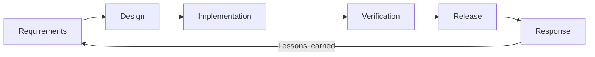

# Security Development Lifecycle (SDL)

**IEC 62443-4-1 SM-1 Compliance**

## 1. Purpose

This document defines the formal Security Development Lifecycle (SDL) for the
RUNE platform. It establishes the security management system required by
IEC 62443-4-1 SM-1, ensuring that security is integrated into every phase of
the development process.

## 2. Scope

This SDL applies to all RUNE repositories:

| Repository | Language | Description |
|---|---|---|
| `rune` | Python | Core CLI and orchestration engine |
| `rune-operator` | Go | Kubernetes operator |
| `rune-ui` | HTMX | Web interface |
| `rune-charts` | Helm | Deployment charts |
| `rune-docs` | MkDocs | Documentation (this repo) |
| `rune-audit` | Mixed | Audit tooling |

## 3. Security Objectives

1. **Confidentiality** -- Secrets (API keys, tokens) never persist in code or
   configuration files; environment variables only.
2. **Integrity** -- All releases carry SLSA L3 signed provenance. Container
   images are signed with cosign (see [IMAGE_SIGNING.md](IMAGE_SIGNING.md)).
3. **Availability** -- Fail-closed cost gates and resource limits prevent
   runaway provisioning.
4. **Traceability** -- Every change is traceable from issue to merge via branch
   protection and mandatory CI gates.

## 4. Roles and Responsibilities

| Role | Responsibility |
|---|---|
| **Project Owner** (`lpasquali`) | Final authority on risk acceptance; reviews all security-relevant PRs |
| **Security Lead** | Owns threat model, risk register ([RISK_REGISTER.md](RISK_REGISTER.md)), and incident response ([INCIDENT_RESPONSE.md](INCIDENT_RESPONSE.md)) |
| **Developer / Agent** | Follows SDL phases; runs audit checks per SYSTEM_PROMPT.md triggers |
| **CI Pipeline** | Enforces automated gates (SAST, SCA, SBOM, license compliance, coverage) |

## 5. SDL Phases

### 5.1 Requirements

- Threat modeling using STRIDE methodology (see [RISK_ASSESSMENT.md](RISK_ASSESSMENT.md)).
- Security requirements derived from IEC 62443-4-1 and SLSA L3.
- Privacy and data-handling requirements documented per feature.

### 5.2 Design

- Architecture Decision Records (ADRs) for security-relevant changes.
- DriverTransport protocol security review for new agent integrations.
- API versioning policy (additive changes preferred; no silent breaking changes).

### 5.3 Implementation

- Secrets in environment variables only -- never in `rune.yaml` or source.
- All dependencies scanned before introduction (`pip-audit`, `grype`, `safety`).
- License gate blocks copyleft licenses (AGPL, GPL-2.0, GPL-3.0) at CI.
- 97% code coverage floor enforced by CI.

### 5.4 Verification

- **Static Analysis (SAST)**: Trivy filesystem scan on every PR.
- **Software Composition Analysis (SCA)**: SBOM generation via Syft; vulnerability scanning via Grype and Trivy.
- **Secret Scanning**: Gitleaks on every push.
- **Penetration Testing**: Quarterly and pre-release (see [PENTEST.md](PENTEST.md)).
- **Fuzz Testing**: Integrated into CI for protocol and API parsers (see [FUZZ_TESTING.md](FUZZ_TESTING.md)).
- **CVE Policy**: Fixable vulnerabilities above CVSS 8.8 block merge. Unfixable above threshold require fork-and-patch.

### 5.5 Release

- Signed provenance attestation (SLSA L3) on all artifacts.
- Container image signing with cosign via Fulcio/Rekor (see [IMAGE_SIGNING.md](IMAGE_SIGNING.md)).
- SBOM published as release artifact.
- VEX statements maintained for known exceptions (see `delivery/VEX.md`).

### 5.6 Response

- Incident response plan with severity classification and SLAs (see [INCIDENT_RESPONSE.md](INCIDENT_RESPONSE.md)).
- Post-incident reviews feed back into Requirements phase.
- Vulnerability disclosure process via GitHub Security Advisories.

## 6. Review Cadence

| Activity | Frequency |
|---|---|
| Threat model review | Quarterly |
| Risk register review | Quarterly |
| Penetration test | Quarterly + pre-release |
| Full audit (legal + cyber) | Milestone exit / quarterly |
| SDL document review | Annually or after major incident |
| Dependency audit | Every PR (automated) |

## 7. Training Requirements

| Audience | Training | Frequency |
|---|---|---|
| All developers | Secure coding practices (OWASP Top 10) | Annually |
| All developers | RUNE SDL process and CI gate operation | Onboarding + annually |
| Security Lead | IEC 62443-4-1 requirements and audit procedures | Annually |
| AI Agents | SYSTEM_PROMPT.md consumption at boot (automatic) | Every session |

## 8. Metrics

- Mean time to remediate critical vulnerabilities (target: < 48 hours).
- Percentage of PRs passing all security gates on first submission.
- Coverage floor adherence (97% minimum).
- Number of risk acceptances in the risk register.

## 9. References

- [IEC 62443-4-1:2018](https://webstore.iec.ch/publication/33615) -- Product security development lifecycle requirements ([ISA overview](https://www.isa.org/standards-and-publications/isa-standards/isa-iec-62443-series-of-standards))
- [SLSA v1.0](https://slsa.dev/spec/v1.0/) -- Supply-chain Levels for Software Artifacts
- [OWASP Top 10](https://owasp.org/www-project-top-ten/) -- Web application security risks
- [Semantic Versioning 2.0.0](https://semver.org/) -- Release versioning
- [External Links Catalog](../reference/EXTERNAL_LINKS.md) -- Complete list of standards and tools cited across rune-docs
- [SYSTEM_PROMPT.md](../context/SYSTEM_PROMPT.md) -- Core constraints and SOP
- [RISK_ASSESSMENT.md](RISK_ASSESSMENT.md) -- Threat modeling methodology
- [RISK_REGISTER.md](RISK_REGISTER.md) -- Active risk register
- [INCIDENT_RESPONSE.md](INCIDENT_RESPONSE.md) -- Incident response plan
- [PENTEST.md](PENTEST.md) -- Penetration testing program
- [FUZZ_TESTING.md](FUZZ_TESTING.md) -- Fuzz testing program
- [IMAGE_SIGNING.md](IMAGE_SIGNING.md) -- Container image signing
